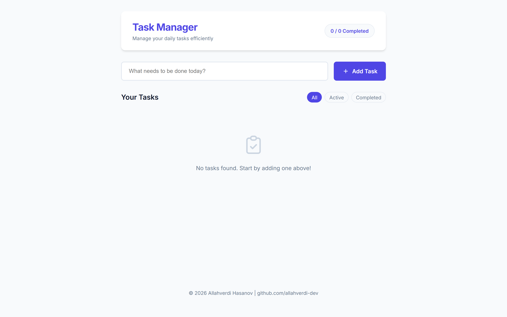
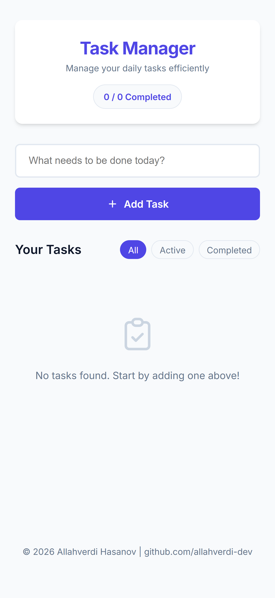

# ✅ Task Manager

A responsive task management web app for creating, organizing, filtering and tracking everyday tasks.

Built with **HTML, CSS and Vanilla JavaScript**.

🌐 **[Live Demo](https://allahverdi-dev.github.io/task-manager/)**

---

## 🖼️ Preview

### Desktop



### 📱 Mobile

<p align="center">
  
</p>

---

## ✨ Features

- Create new tasks
- Delete tasks
- Mark tasks as completed
- Switch between **All**, **Active** and **Completed** tasks
- Track completed tasks with a progress counter
- Persist tasks between browser sessions with `localStorage`
- Responsive desktop and mobile layouts
- Empty state when no tasks are available
- Keyboard-friendly form controls
- Accessible interface elements

---

## 🛠️ Tech Stack

| Technology | Purpose |
|---|---|
| HTML5 | Semantic page structure |
| CSS3 | Styling and responsive layouts |
| Vanilla JavaScript | Task logic and interactivity |
| LocalStorage | Persistent task data |
| GitHub Pages | Static deployment |

The project uses **no frontend framework or build tool**.

---

## 🤖 AI-Assisted Development

Task Manager was created using an **AI-assisted development workflow**.

- **ChatGPT** — planning, problem-solving and iteration
- **Claude Code** — implementation, debugging and refinement

I directed the project structure, feature decisions, testing and revisions while continuing to strengthen my HTML, CSS and JavaScript fundamentals.

This project is part of my broader learning process: using AI tools to turn ideas into working products while gradually developing a deeper understanding of the code behind them.

---

## 🧩 How It Works

The application keeps the task-management flow intentionally simple.

1. Enter a task in the input field
2. Add it to the task list
3. Mark it as completed when finished
4. Filter tasks by their current state
5. Delete tasks that are no longer needed

The completion counter updates as tasks change.

---

## 🔎 Task Filtering

Tasks can be viewed in three states:

- **All** — displays every task
- **Active** — displays unfinished tasks
- **Completed** — displays finished tasks

Filtering happens directly in the browser without requiring a page reload.

---

## 💾 Local Storage

Task data is stored in the browser using `localStorage`.

This means:

- Tasks remain after refreshing the page
- Tasks remain when the browser is reopened
- No account is required
- No backend or database is used
- Task data remains local to the user's browser

---

## 📱 Responsive Design

Task Manager is designed to adapt across desktop and mobile screens.

Responsive behavior includes:

- Flexible content sizing
- Mobile-friendly task controls
- Adaptive form layouts
- Touch-friendly buttons
- Responsive spacing and typography
- Consistent visual hierarchy across screen sizes

---

## ♿ Accessibility

The interface includes practical accessibility-focused improvements such as:

- Semantic HTML
- Accessible form controls
- Keyboard-friendly interactions
- Visible interface states
- Clear task status changes
- Readable typography and contrast

This project does not claim formal WCAG certification.

---

## 📁 Project Structure

<details>
<summary>View project structure</summary>

```text
task-manager/
├── screenshots/
│   ├── task-manager-desktop-dashboard.png
│   └── task-manager-mobile.png
│
├── index.html
├── style.css
├── script.js
└── README.md
```

### Main responsibilities

- `index.html` — application structure and task interface
- `style.css` — visual design and responsive layouts
- `script.js` — task creation, deletion, completion, filtering and persistence

</details>

---

## 🚀 Run Locally

### 1. Clone the repository

```bash
git clone https://github.com/allahverdi-dev/task-manager.git
cd task-manager
```

### 2. Open the application

You can open `index.html` directly in your browser.

For a local development server, use Python:

```bash
python3 -m http.server 5173
```

or Node.js:

```bash
npx serve -l 5173
```

Then open:

```text
http://localhost:5173
```

No installation or build step is required.

---

## 🎯 Project Goals

This project was created to practice and explore:

- DOM manipulation
- JavaScript events
- Working with arrays and objects
- Managing application state
- Local browser storage
- Filtering data in the interface
- Responsive web design
- Accessible UI patterns
- Structuring a small Vanilla JavaScript application

---

## 🌱 What I'm Learning

Task Manager is part of my ongoing frontend learning process.

I'm currently strengthening my understanding of:

- HTML
- CSS
- JavaScript
- DOM manipulation
- Event handling
- Application state
- LocalStorage
- Responsive design
- Git and GitHub

My goal is to increasingly understand and implement projects like this independently while continuing to use AI tools as part of my development workflow.
